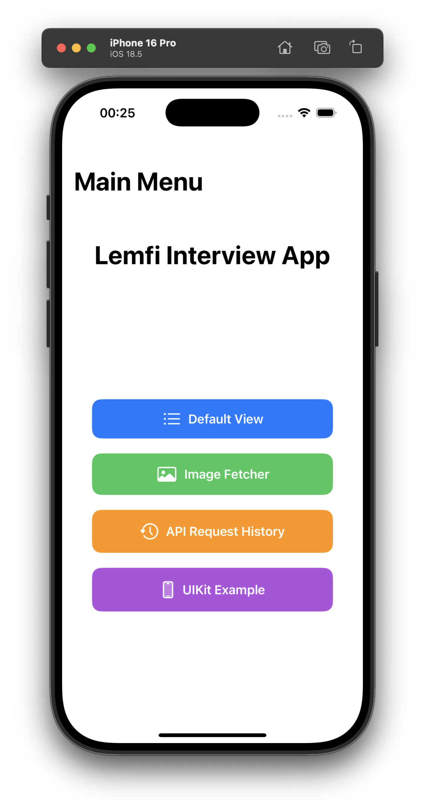
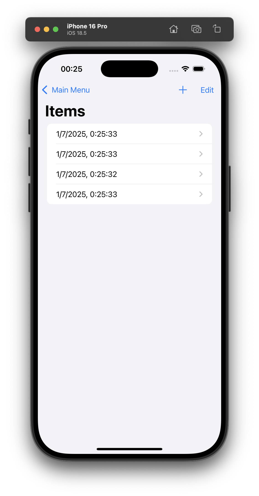
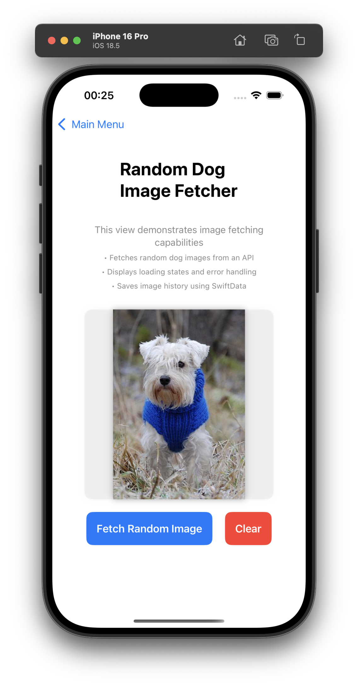
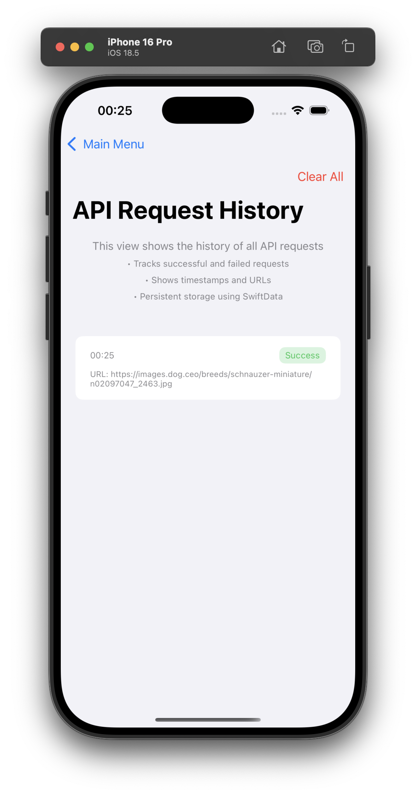
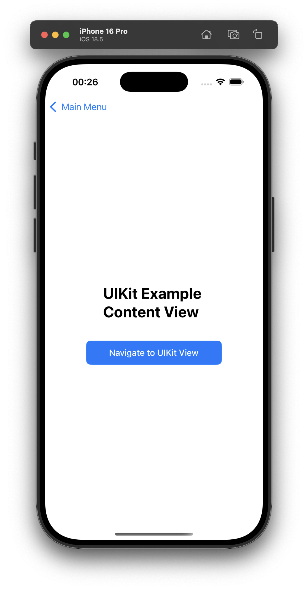

# API Request Example iOS

A comprehensive iOS application demonstrating modern API request handling, SwiftUI/UIKit integration, and data persistence using SwiftData. This app showcases various iOS development patterns and best practices.

## 🎯 Features

### 🏠 Main Menu
The app provides a clean, intuitive main menu with four key features:



### 📋 Default View
A basic SwiftData implementation demonstrating:
- ✅ CRUD operations with SwiftData
- ✅ List management with add/delete functionality
- ✅ Real-time data updates
- ✅ SwiftUI navigation integration



### 🐕 Image Fetcher
Advanced API integration showcasing:
- ✅ Async/await network requests
- ✅ Random dog image fetching from [Dog API](https://dog.ceo/dog-api/)
- ✅ Loading states and error handling
- ✅ Image caching and display with AsyncImage
- ✅ SwiftData persistence for API request history
- ✅ Modern MVVM architecture pattern



**Key Components:**
- `ImageFetcherClient`: Protocol-based HTTP client
- `ImageFetcherViewModel`: Reactive view model with Combine
- `NetworkManager`: Generic network layer
- `ImageModel`: SwiftData model for persistence

### 📊 API Request History
Comprehensive request tracking featuring:
- ✅ Complete history of all API requests
- ✅ Success/failure status indicators
- ✅ Timestamps and URL logging
- ✅ Error message display
- ✅ Bulk clear functionality
- ✅ SwiftData queries with sorting



### 📱 UIKit Integration
Seamless SwiftUI ↔ UIKit navigation:
- ✅ UIViewRepresentable wrappers
- ✅ Programmatic UIKit view controllers
- ✅ Navigation between SwiftUI and UIKit
- ✅ Modern UIButton configurations
- ✅ Bidirectional navigation flow



## 🏗️ Architecture

### 📁 Project Structure
```
api-request-example-ios/
├── 📱 App Entry Point
│   └── api_request_example_iosApp.swift
├── 🎨 UI Layer
│   ├── ContentView.swift (Main Menu)
│   ├── Default/ (SwiftData CRUD Demo)
│   ├── ImageFetcher/ (API Integration)
│   ├── ImageHistory/ (Request Tracking)
│   └── UIKitExample/ (UIKit Integration)
├── 🗺️ Navigation
│   ├── NavigationCoordinator.swift
│   └── NavigationDestination.swift
└── 🌐 Infrastructure
    ├── HTTPClient.swift (Protocol)
    ├── RemoteHTTPClient.swift (Implementation)
    ├── NetworkManager.swift (Generic Layer)
    ├── HTTPClientManager.swift (Factory)
    └── NetworkError.swift (Error Handling)
```

### 🔧 Technical Implementation

**Network Layer:**
- Protocol-oriented design for testability
- Generic `NetworkManager` for type-safe API calls
- Comprehensive error handling with custom `NetworkError` enum
- Async/await support throughout

**Data Persistence:**
- SwiftData for modern Core Data abstraction
- Reactive `@Query` and `@Model` implementations
- Automatic data synchronization

**Architecture Patterns:**
- MVVM with reactive programming
- Coordinator pattern for navigation
- Dependency injection for HTTP clients
- Protocol-based abstractions

## 🧪 Testing

Comprehensive test suite covering:
- ✅ `ImageFetcherViewModel` with mock dependencies
- ✅ `APIRequestHistoryViewModel` functionality
- ✅ SwiftData persistence operations
- ✅ Error handling scenarios
- ✅ Loading state management

**Test Features:**
- Mock `ImageFetcherClient` for isolated testing
- In-memory SwiftData containers
- Async test operations with proper timing
- Complete view model state testing

## 🚀 Getting Started

### Prerequisites
- Xcode 15.0+
- iOS 17.0+
- Swift 6.0

### Installation
1. Clone the repository:
   ```bash
   git clone https://github.com/your-username/api-request-example-ios.git
   ```

2. Open the project:
   ```bash
   cd api-request-example-ios
   open api-request-example-ios.xcodeproj
   ```

3. Build and run:
   - Select your target device/simulator
   - Press `Cmd + R` or click the Run button

### Running Tests
```bash
# Run all tests
Cmd + U

# Or use the command line
xcodebuild test -scheme api-request-example-ios -destination 'platform=iOS Simulator,name=iPhone 15'
```

## 🎨 UI/UX Features

- **Modern SwiftUI Design**: Clean, native iOS interface
- **Responsive Layouts**: Adaptive to different screen sizes
- **Loading States**: Smooth animations and progress indicators
- **Error Handling**: User-friendly error messages
- **Color-Coded Status**: Visual indicators for success/failure
- **Accessibility**: VoiceOver support and semantic labels

## 🔗 API Integration

The app integrates with the [Dog CEO API](https://dog.ceo/dog-api/):
- **Endpoint**: `https://dog.ceo/api/breeds/image/random`
- **Method**: GET
- **Response**: JSON with random dog image URL
- **Features**: No authentication required, rate-limited

## 📝 Code Quality

- ✅ Swift 6.0 compliance
- ✅ Clean code principles
- ✅ SOLID design patterns
- ✅ Comprehensive documentation
- ✅ Protocol-oriented programming
- ✅ Error handling best practices
- ✅ Memory management optimization

## 🤝 Contributing

1. Fork the repository
2. Create a feature branch (`git checkout -b feature/amazing-feature`)
3. Commit your changes (`git commit -m 'Add some amazing feature'`)
4. Push to the branch (`git push origin feature/amazing-feature`)
5. Open a Pull Request

## 📄 License

This project is licensed under the MIT License - see the [LICENSE](LICENSE) file for details.

## 🙏 Acknowledgments

- [Dog API](https://dog.ceo/dog-api/) for providing the free dog image service
- Apple's SwiftUI and SwiftData frameworks
- The iOS developer community for best practices and patterns

---

**Built with ❤️ using SwiftUI, SwiftData, and modern iOS development practices**
